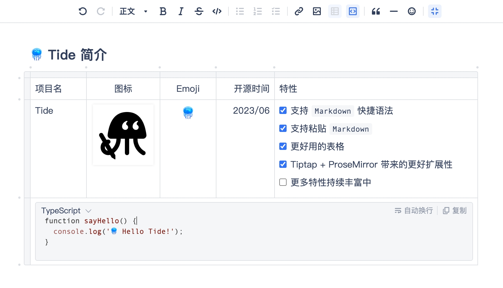

# [Tide 🪼](https://gitee.com/oschina/tide)

开箱即用、扩展性强、支持 Markdown 语法、基础功能完善的 React 富文本编辑器。

[](https://www.npmjs.com/package/@gitee/tide)
[](https://npmcharts.com/compare/@gitee/tide?minimal=true)
[](https://www.npmjs.com/package/@gitee/tide)

## 在线演示

https://oschina.gitee.io/tide



## 示例代码

- [基本](./packages/editor/README.zh-CN.md)
- [复杂](./apps/demo)
- [真实项目](./apps/legacy)

## 特性

- 基于 JSON 格式存储
- 支持 Markdown 快捷语法
  - 标题
  - 引用
  - 代码块
  - 表格
  - 超链接
  - 图片
  - 分割线
  - 粗体、斜体、删除线
  - 无序列表、有序列表、任务列表
- 支持粘贴 Markdown 文本
- 支持功能增强的 Table 表格
- 支持粘贴、拖拽图片
- 支持 Emoji 表情选择
- 内建菜单栏
- 支持多主题

## 目录

```
.
├── apps
│   ├── demo                      # 演示项目，部署在 Pages 上，地址：https://oschina.gitee.io/tide
│   └── legacy                    # 真实项目，Gitee 社区版正在使用，包名为 @gitee/tide-legacy
├── presets                       # 提供 @、#、! 引用（mention）功能的预知 UI 和配置，
│                                 # 主要 @gitee/tide-legacy 在使用
├── docs                          # 文档（待完善），包括：如何贡献
├── packages                      # 组织 monorepo 的包目录
│   ├── editor                    # 开箱即用的编辑器基础包，包名为 @gitee/tide
│   ├── starter-kit               # 将常用的扩展包集成在一起，配合 @gitee/tide 包使用，提供开箱即用体验
│   ├── common                    # 常用的工具类等
│   ├── react                     # 提供编辑器的 React 封装，便于在 React 项目中使用
│   ├── extension-*               # extension- 开头的包，提供编辑器的扩展功能
│   ├── tsconfig                  # 统一的 tsconfig 配置
│   └── eslint-config-custom      # 统一的 eslint 配置
└── scripts                       # 提供简化开发流程的脚本等
```

## 构建和运行

Tide 使用 [turborepo](https://turbo.build/repo) 来管理多个 npm 包的编译和分发，使用 [pnpm](https://pnpm.io) 来管理本地依赖。

```shell
git clone https://gitee.com/oschina/tide.git

cd tide

# 安装依赖
pnpm i

# 构建 packages
pnpm build

# 运行 demo 方便开发，会自动打开浏览器
pnpm dev:demo --open
```

> 由于 monorepo 依赖关系复杂，暂不支持本地构建后通过 `npm link`、`yarn link` 和 `pnpm link --global` 方式使用本地构建的版本。

## 贡献

- 提交 Bug 请使用 [Issues](https://gitee.com/oschina/tide/issues)
- 贡献代码请使用 [Pull Request](https://gitee.com/oschina/tide/pulls)，创建 Pull Request 前请先阅读 [CONTRIBUTING.md](./docs/CONTRIBUTING.md)

## 谁在使用

- [Gitee 企业版](https://e.gitee.com)
- [Gitee 社区版](https://gitee.com)

## 感谢

- [Tiptap](https://github.com/ueberdosis/tiptap)
- [ProseMirror](https://github.com/ProseMirror/prosemirror)
